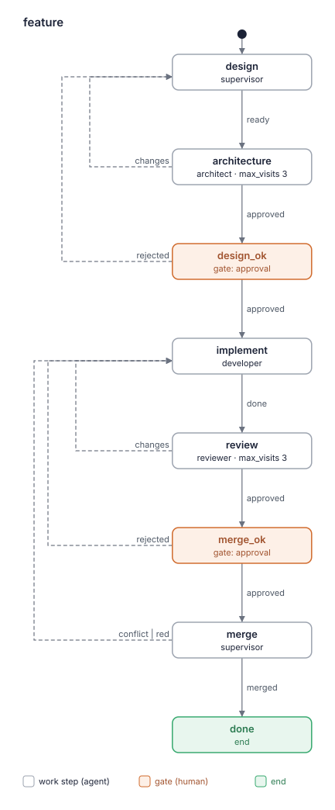
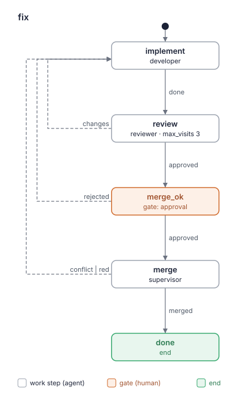

# Kit report: lado-dev 0.10.2

- Дата: 2026-10-07
- Кит: worktree run'а `improve/lado-dev-3` (`.lado/worktrees/kit-lado-dev/improve-lado-dev-3`), ветка `lado/kit-lado-dev/improve-lado-dev-3`
- Коммит: `3743a65`
- Оценивал: критик kit-builder (слои a и b)
- Режим: повторная оценка, визит 1 шага `evaluate` в `improve`, нужен вердикт.
  - Предыдущий отчёт: `kit-reports/lado-dev-0.10.1-2026-10-06.md`. План называет для него коммит `a6d6cd7`, он же база.
  - Изменение: `git diff a6d6cd7 -- kit.yaml README.md BLUEPRINT.md agents flows skills`. Затронуты 4 файла: kit.yaml, BLUEPRINT.md, `agents/supervisor.md`, `skills/lado-checks/SKILL.md`.
- Проходы. Три независимых суб-агента прошли по изменённому тексту и тому, что его окружает. Каждый получил рубрику, кит, diff, план, зависимые скиллы и репозиторий LADO (`3392bd8`) для проверки фактов.
  - Проход 1 начал с kit.yaml и ролей.
  - Проход 2 начал с flows и прослеживал сценарии implement → review → merge_ok → merge и релиз.
  - Проход 3 начал с `lado-checks` и применил новое правило к каждому модулю `src/lado` реальным grep.
  - Вырезанные правила проверил сам критик по `git diff --word-diff`.
  - Полный проход (Re-evaluation 5) по четырём затронутым файлам целиком сделал четвёртый суб-агент. Его находки критик сверил с файлами.
  - Отброшены 2 однопроходные находки:
    - «`src/lado/server/` убран из строки `make web`, устаревший `openapi.json` всплывёт на merge». Опровергнута: поиск по пакету для любого модуля `server/` находит `tests/ui/test_live_updates.py`, а с ним идёт `make web`. Кроме того, `tests/test_server.py:182` (`test_the_committed_openapi_schema_is_the_servers`) входит в `make test`.
    - «Для `mcp_server.py`, `hooks.py`, `providers/base.py` integration-тесты не идут до merge». Это решение плана; перенесено в «Questions for the human».
  - Как подтверждённая оставлена 1 однопроходная находка (F3.15).

Находки — кандидаты, которые взвешивает человек. Это не оценка «прошёл / не прошёл».

## Card

| Слой | Результат |
|---|---|
| a. `lado kits check` | OK, 0 предупреждений |
| a. Бюджет | жёлтый. Все числовые меры зелёные. Жёлтые только 3 пары похожих абзацев (92%, 79%, 77%), они обоснованы в BLUEPRINT.md §4. Слов: developer 800, supervisor 800 (порог для лида 1000), reviewer 785, architect 574. |
| a. Flows | нарисованы 2; совпадают со скелетами BLUEPRINT.md (`same as the plan`) |
| b. Рубрика | 10 находок в изменённом тексте: 0 high, 7 medium, 3 low. Ещё 3 в «Missed earlier»: 1 medium, 2 low. В изменённом тексте без находок 8 из 12 критериев (1, 2, 4, 7, 8, 10, 11, 12). Из 12 пунктов плана все 12 RESOLVED; у трёх есть остаток, он вынесен в новую находку. |
| Охват | повторная оценка изменённого текста плюс полный проход по 4 файлам, которые затронул diff |
| Stop rule | не выполнено: 7 medium в изменённом тексте. Это совет для гейта релиза, не блок. |

Счёт относится только к тому, что указано в строке «Охват». Сравнивать его со счётом полной оценки нельзя.

### `lado kits check .`

```
lado-dev: OK (3 agents, 20 skills, 4 packs and 2 flows)
```

### Budget script (exit status 0)

```
# Complexity budget: lado-dev 0.10.2

| Measure | Where | Value | Green / yellow up to | Zone |
|---|---|---|---|---|
| Worker roles (not supervisor) | kit | 3 | 3 / 5 | green |
| Work steps in a flow | flows/feature.yaml | 5 | 5 / 8 | green |
| Work steps in a flow | flows/fix.yaml | 3 | 5 / 8 | green |
| Gates in a flow | flows/feature.yaml | 2 | 2 / 3 | green |
| Gates in a flow | flows/fix.yaml | 1 | 2 / 3 | green |
| Words in a role prompt | agents/architect.md | 574 | 800 / 1500 | green |
| Words in a role prompt | agents/developer.md | 800 | 800 / 1500 | green |
| Words in a role prompt | agents/reviewer.md | 785 | 800 / 1500 | green |
| Words in the lead's prompt | agents/supervisor.md | 800 | 1000 / 1500 | green |
| Own skills | kit | 1 | 5 / 10 | green |
| MCP servers | kit | 0 | 2 / 4 | green |

## Similar paragraphs (one rule, one place; 55% similar or more)

- yellow: 92% similar: flows/feature.yaml: state "review": "Review the run's branch against main, read-only, as your role describes: the ..." ~ flows/fix.yaml: state "review": "Review the run's branch against main, read-only, as your role describes: the ..."
- yellow: 79% similar: flows/feature.yaml: state "implement": "Implement the design (the note from design, as the human approved it) in the ..." ~ flows/fix.yaml: state "implement": "Implement the task in the run's worktree, test-first, as your role describes...."
- yellow: 77% similar: agents/architect.md: "Most reviews come as a step of a flow run (a message from `lado`): the design..." ~ agents/reviewer.md: "Most reviews come as a step of a flow run (a message from `lado`): the step s..."

Overall: yellow
```

### Flows




```
same as the plan in BLUEPRINT.md
(exit status 0)
```

## Fix first

Вердикт `approved`. `lado kits check` прошёл без ошибок, красных мер нет, жёлтые обоснованы, `--compare` различий не нашёл, high-находок нет. Новое правило однозначно для обычной правки модуля: `runs.py`, `providers/kilo.py`, `server/*.py`, `pyproject.toml` дают одинаковый выбор. Края, где developer и reviewer всё ещё выберут по-разному, лежат вне правила для модулей. Это пункты 1–3, все они в таблице `lado-checks:21-31` и `:45`.

1. Строка для изменённого conftest или хелпера под `tests/`: сейчас её нет (F3.12).
2. Строка `web/`: вернуть запасной вариант для файла, который не назван по экрану (F3.13). Таблица: «every row that matches» вместо «its row» (F3.14).
3. «Больше 10 unit-попаданий» — сказать, что считаются попадания обоих поисков вместе (F3.15).
4. Ошибка среды у разработчика: какой статус. Супервизор ждёт «environment message», а у разработчика такого статуса нет (F5.11).
5. Релиз: что делать при красном CI или live после push main (F3.16); какие live-тесты нужны релизу (F5.12, F6.3).

## Findings

### 1. Role boundaries

Релиз принадлежит супервизору: «**Release** (the supervisor, only when the human asks)» (`lado-checks:89`). Исправляет только разработчик: «Only the developer fixes» (`:129`). Пересечений нет.

### 2. Handoffs between steps

Concern о пропущенном провайдере доходит до `merge_ok` через `needs: [implement]` в DONE_WITH_CONCERNS разработчика. `red` из merge несёт «the failing output in the note» (`:119`). Нот без источника нет.

### 3. Done and outcomes

- **F3.12** [medium] `skills/lado-checks/SKILL.md:26`
  > | A test file outside `tests/live/` | that file, with its folder's `-m` |

  Изменённый хелпер или conftest не попадает однозначно ни в одну строку. `:42` («a hit in a `conftest.py` or a helper pulls in nothing») относится только к попаданиям поиска.
  - `tests/integration/fake_provider.py` импортирует `tests/integration/conftest.py`, то есть от него зависит каждый integration-тест. Если считать его «test file», выйдет `pytest -m integration tests/integration/fake_provider.py` → «no tests collected». По `:50` это «proves nothing».
  - `tests/agent_helpers.py` можно прочитать как «A path no row matches» → `make test`. Это только unit-тесты, без integration- и UI-файлов, которые его импортируют.

  Developer и reviewer выберут разное. Сломанный хелпер всплывёт только на merge, а `red` проведёт run ещё раз через `implement`, `review` и гейт `merge_ok`. План решал про хелперы как *попадания поиска*, а не про *правку* хелпера (это бывшая половина F3.3).
  Fix: строка «A `conftest.py` or helper under `tests/` | every `test_*.py` in its folder, with its `-m`; under `tests/` itself, `make test`». Или явно: «falls to "A path no row matches"».
  Passes: 3/3 и full pass (pytest `--collect-only` на обоих файлах → «no tests collected»; `grep -rln fake_provider tests` → `tests/integration/conftest.py`)

- **F3.13** [medium] `skills/lado-checks/SKILL.md:27` (cut-rule check)
  > | `web/` | `make web` (also fails on a stale `web/openapi.json`), `make browser`, then the UI tests of each screen it changes, by file name (`tests/ui/test_<screen>.py`) |

  В базе строка (`a6d6cd7`, `:28`) кончалась так: «all of `tests/ui/` when unsure». Этого запасного варианта больше нигде нет. План его не убирал: «integration/UI only as hits» говорит о поиске по импортам, а не об этой строке.
  - Без экрана с таким именем: `Shell.tsx`, `App.tsx`, `styles.css`, `tokens.css`, `api.ts`, `live.ts`, `Settings.tsx`, `Team.tsx`.
  - Неоднозначно: `Sessions.tsx` может значить `test_session_list.py` или `test_sessions_strip.py`.

  При правке `styles.css` один агент не запустит UI-тестов вообще, другой запустит `test_layout.py` или все. Это прямо против цели плана.
  Fix: вернуть «; a file that names no screen: all of `tests/ui/` (`-m ui`)». Или решить «none: `make check` at merge covers it» — главное, чтобы вариант был один.
  Passes: 3/3 и full pass, cut-rule check

- **F3.14** [medium] `skills/lado-checks/SKILL.md:21` (cut-rule check)
  > `make lint` (`make fmt` fixes most of it), then for each changed path its row:

  В базе было «every row that matches it» (`:21-22`). Под две строки по-прежнему подходят:
  - `tests/js/*.test.mjs` — «A test file outside `tests/live/`» (pytest с `-m` для `.mjs` бессмыслен) и `make test-js`;
  - `web/src/*.test.tsx`.

  «its row» не говорит, какая из двух.
  Fix: вернуть «every row that matches it» и в `:26` написать «A `test_*.py` file outside `tests/live/`».
  Passes: 2/3, cut-rule check

- **F3.15** [medium] `skills/lado-checks/SKILL.md:45`
  > hit, or more than 10 unit hits, run `make test` in place of its unit hits. Integration

  Для модуля в пакете поиск идёт дважды, и не сказано, считаются ли попадания каждого поиска отдельно или обоих вместе. Для `src/lado/server/app.py` поиск с `P=lado.server` даёт ровно 10 unit-файлов, а оба поиска вместе — 11. По одному прочтению запускаются 10 файлов, по другому — `make test`. Ревьюер запишет это как «wrong check» (Minor, `:80-82`).
  Fix: «more than 10 unit hits, both searches together».
  Passes: 1/3, confirmed (grep в LADO `3392bd8`: `P=lado.server mod=app` → 10 файлов `tests/test_*`; вместе с `P=lado mod=server` → 11)

- **F3.16** [medium] `skills/lado-checks/SKILL.md:91`
  > push main; wait for green CI on that commit (CI runs everything `make check` runs, so no

  Порядок релиза задан, но не сказано, что делать, если CI или live после push main красные. В этот момент push уже ушёл с машины, и на main лежит version bump без тега. Супервизор не пишет код, никто не классифицирует сбой (code/test/environment), и не сказано, нужен ли повторный коммит версии. Это known hole 1 на релизе: агенты поступят по-разному (повторить, запустить `fix`, спросить).
  Fix: «Red CI or red live tests: no tag; tell the human with the failing line; a fix goes through `fix`, then the release goes on from push main with the same version».
  Passes: 2/3 и full pass (`ci.yml`: `push: branches: [main]`; `release.yml`: `tags: ["v*"]`)

- **F3.17** [low] `skills/lado-checks/SKILL.md:125` (state `merge`)
  > check of step 3 was green on it. Then report `merged`.

  Новое исключение говорит: «a commit of BACKLOG.md alone after a green check needs no new check» (`:117`). Но Done по-прежнему требует зелёной проверки на последнем коммите, и буквальный супервизор запустит `make check` в третий раз. Кроме того, в `:118` («classify the first error») не сказано, первый ли это прогон или второй, хотя класс flaky там же означает «Rerun up to 2 times».
  Fix: в `:125` — «…green on it, or on its parent when the last commit only adds BACKLOG.md entries». В `:118` — «the second run's first error, as code, test or environment».
  Passes: 2/3 (проход 2 и полный проход)

### 4. Independent verification

Flows не менялись: `review` (`max_visits: 3`), затем гейт `merge_ok`, затем полный `make check` в `merge`. Ревьюер сам запускает «the same checks yourself» (`:79`). Тег ставится только после зелёного CI.

### 5. Contradictions

- **F5.11** [medium] `agents/supervisor.md:79`
  > on; for environment, tell the human what is missing, then have the worker rerun its check.

  Супервизор теперь обрабатывает «environment message». Ревьюер его шлёт (`reviewer.md:86`), а у разработчика такого сообщения нет: «Status is one of DONE | DONE_WITH_CONCERNS | NEEDS_CONTEXT | BLOCKED» (`agents/developer.md:76`). Новый `lado-checks:66-67` к тому же учит, что пропуск по окружению — это DONE_WITH_CONCERNS, а он завершает шаг. Возьмём не-live проверку, упавшую по окружению (нет tmux, `make browser` без сети). Один разработчик по аналогии отчитается DONE_WITH_CONCERNS и продвинет run с проверкой, которая не была зелёной. Другой отправит BLOCKED.
  Fix: в `lado-checks` «When a check fails», пункт environment: «the developer reports BLOCKED with what is missing; only a live provider skipped for it is DONE_WITH_CONCERNS (Live tests)».
  Passes: 3/3 и full pass (`grep -n environment agents/developer.md` → нет совпадений; импакт по проходам low, medium, medium — взят medium)

- **F5.12** [medium] `skills/lado-checks/SKILL.md:92`
  > separate `make check`); the live tests, as above; push the tag `vX.Y.Z`, which publishes

  «as above» отсылает к правилу для правки: «run only the other providers the change needs, … or none» (`:63-64`). Но `:94` говорит иначе: «the other providers' live tests must be green». У релиза нет «изменения», а версия без правок провайдеров по `:63` может уйти в PyPI вообще без live-тестов. Публикацию не отменить.
  Fix: в `:92` — «the live tests of every provider (`make test-live`; on a no to Claude, each other provider with `PROVIDER=<name>`)».
  Passes: 2/3 (импакт по проходам medium и low — взят medium)

### 6. Duplication

- **F6.3** [low] `BLUEPRINT.md:38`
  > declines it, the live tests of the other providers the change needs must be green, and

  R9 говорит о релизе и пишет «the change needs», а в скилле на релизе написано «the other providers' live tests must be green» (`lado-checks:94`). Две копии снова расходятся, как в F6.2. Это та же неясность, что в F5.12.
  Fix: выровнять R9 с решением F5.12.
  Passes: full pass, confirmed

### 7. When to call the human

В изменённом тексте нарушений нет. Каждый push — «Each push needs the human's yes» (`:95`). Платный прогон — с «да» каждый раз. Ошибку среды на merge супервизор относит человеку (`:120`). Пробел с красным CI на релизе — F3.16.

### 8. Loops on a later visit

Flows не менялись. Перезапуск на merge ограничен: «rerun the whole check once» (`:114-115`). `implement` на повторном визите знает, что исправлять: «a red check of the merge step».

### 9. Concision and why

- **F9.1** [low] `skills/lado-checks/SKILL.md:164`
  > the tier it belongs to (P0–P3, as BACKLOG.md's header says): `.gitattributes` merges BACKLOG.md with `merge=union`, so entries that

  Абзац после правки не переформатирован, строка около 130 знаков. Только оформление.
  Fix: переформатировать абзац.
  Passes: 2/3

Новое правило несёт причину: «the full `make check` at merge covers them, so a short rule both developer and reviewer apply alike beats a complete one» (`:46-47`). Скилл стал короче. Роли — ровно по 800 слов.

### 10. Skill descriptions

Описания и списки скиллов не менялись. Что описание не упоминает релиз — F10.1 в «Missed earlier».

### 11. Provider neutrality

Имён инструментов CLI нет. `PROVIDER` — переменная Makefile LADO (`-k $(PROVIDER)`).

### 12. Safety and scope

В изменённом тексте нарушений нет:
- прямой коммит на main разрешён только для версии и только по просьбе человека: «the request allows one direct commit on main, the version bump» (`:89-90`);
- тег — после зелёного CI;
- каждый push — с «да»;
- `flow_cancel` совпадает с LADO: «Cancel an open flow run: its workers are finished, its worktree and branch are kept» (`mcp_server.py`).

## Known holes

| Known hole | Finding, or how the kit handles it |
|---|---|
| 1. Red check sent back with no environment cause considered | Merge закрыт: «Environment: tell the human what is missing and leave the step open» (`lado-checks:120`). Ревьюер закрыт: `:82-87`. Открыто у разработчика для не-live проверок (**F5.11**) и на релизе при красном CI (**F3.16**). |
| 2. Work outside a flow, merge without a gate | Код идёт только через flow (`supervisor.md:62-63`). Коммит версии — явное исключение: просьба человека плюс «Each push needs the human's yes» (`lado-checks:89-95`). То, что §3 роли этого не знает, — F5.13 (Missed earlier). |
| 3. Path outside the run's worktree | Закрыто: лог «outside the tree» (`:101`), merge «In the run's worktree», бриф — по абсолютному пути. |
| 4. Verdict without a severity threshold | Закрыто: «The answer is Yes when no Critical or Important finding is open» (`agents/reviewer.md:82-83`). Пропущенная проверка — «Important when your own run of it is red for code or test, otherwise Minor» (`lado-checks:81-82`). |
| 5. Dependency skill that writes or asks where its role must not | Закрыто: `tdd` — «without asking the human» (`agents/developer.md:35`); `receiving-code-review` — «a question for the human goes to the supervisor» (`agents/developer.md:100-101`). Изменение не добавило ни одного скилла. |

## Not traced

Нет. Каждая роль, шаг, гейт и скилл есть в трассировке BLUEPRINT.md §3. Жёлтые пары обоснованы в §4. `--compare`: «same as the plan in BLUEPRINT.md». Расхождение R9 со скиллом — F6.3.

## Previous findings

Находки отчёта `kit-reports/lado-dev-0.10.1-2026-10-06.md` и пункты плана:

| Находка | Статус | Доказательство |
|---|---|---|
| F3.3 integration через хелпер при правке провайдера | RESOLVED | Исключения убраны: «Only `test_*.py` hits run; a hit in a `conftest.py` or a helper pulls in nothing» (`:42`). Правка самого хелпера — новая находка F3.12. |
| F3.7 неполный перечень модулей для integration | RESOLVED | Строки с перечнем нет; «Integration and UI tests run only as hits» (`:45-46`). |
| F5.8 общее ограничение UI/integration против `-m` попаданий | RESOLVED | «Each runs with its folder's `-m`» (`:42-43`); противоречащего предложения нет. |
| F3.8 провайдер, пропущенный по окружению | RESOLVED | `:66-67` «the developer reports DONE_WITH_CONCERNS naming it»; `:85-87` «or names a provider skipped for an environment cause: then that absence is a concern for `merge_ok`». |
| F3.9 при «нет» — только нужные провайдеры | RESOLVED | `:63-64` «run only the other providers the change needs, one `make test-live PROVIDER=<name>` each, or none». Перенос на релиз — F5.12. |
| F3.10 flaky на merge: перезапуск до классификации | RESOLVED | `:114-116` «rerun the whole check once before classifying; this rerun takes the place of the reruns». |
| F3.11 коммит одного BACKLOG.md | RESOLVED | `:117` «a commit of BACKLOG.md alone after a green check needs no new check». Done в `:125` не согласован — F3.17. |
| F12.1 порядок релиза и коммит версии | RESOLVED | `:89-95`, `supervisor.md:70-71` «in the order `lado-checks` gives: one direct commit on main, then pushes and checks». Нет пути при красном CI — F3.16. |
| F7.1 сообщение ревьюера об окружении | RESOLVED | `supervisor.md:77-79` «A worker's NEEDS_CONTEXT, BLOCKED or environment message leaves its step open». Сторона разработчика — F5.11. |
| F5.9 `flow_cancel` и workers | RESOLVED | `supervisor.md:32-33` «finishes the workers and keeps the worktree and branch». |
| F5.10 шаблон BACKLOG.md | RESOLVED | `:157` «Size: <S\|M\|L>. Why here: <reason>.» |
| F6.2 R9 против скилла | RESOLVED | `:93-95` выровнен с R9 («must be green and the human decides whether to release»). Новое расхождение из-за «the change needs» в R9 — F6.3. |
| Похожие абзацы (жёлтый бюджет) | оставлено планом | BLUEPRINT.md §4 |

Список fixed / not fixed автора сверен с файлами и совпадает. Замечания автора (строка «A path no row matches» сохранена, `src/lado/server/` убран из строки UI) тоже проверены. Первое правильно. Второе вреда не несёт: см. «Cut rules».

## Cut rules

| Removed rule (file:line at base) | Where it is now |
|---|---|
| «for each changed path every row that matches it» (`lado-checks:21-22`) | `:21` «its row» — сужено, под две строки по-прежнему подходят — **F3.14** |
| строка «Code that drives processes … also the integration tests … or all of them» (`:27`) | убрана планом; `:45-47` «Integration and UI tests run only as hits … the full `make check` at merge covers them» |
| `src/lado/server/` в строке `make web` (`:28`) | убрано планом. Проверка устаревшего `openapi.json` сохраняется: поиск для любого модуля `server/` находит `tests/ui/test_live_updates.py` (с ним идёт `make web`), а `tests/test_server.py:182` входит в `make test` |
| «all of `tests/ui/` when unsure» (`:28`) | нигде — **F3.13** (потеряно) |
| «`tests/conftest.py` stands for the unit files in `tests/` only» и исключения про conftest (`:44-49`) | убраны планом; `:42`. Правка хелпера — F3.12 |
| строка «Anything else: … a module the search finds no test file for or more than 10 …» (`:33`) | `:31` «A path no row matches» и `:44-45` «no `test_*.py` hit, or more than 10 unit hits» |
| «say why (environment, "When a check fails")» (`:66`) | `:66-67` |
| «The rows of the table are the whole proof» (`:71`) | `:71` «The checks above are the whole proof» |
| Release: «no separate `make check` … green CI and green live tests on the release commit … the other providers' live tests run and must be green» (`:93-96`) | `:89-95` |
| «push the tag only when they are green on the exact release commit» (`supervisor.md:70-71`) | `lado-checks:93` «The tag needs green CI and green live tests on that commit» |
| «`flow_cancel` keeps them, and ends a run only on the human's decision» (`supervisor.md:32-33`) | `supervisor.md:32-33` |
| «Cancel the run only on the human's decision» (`supervisor.md:79`) | `supervisor.md:32` «`flow_cancel`, only on the human's decision» |
| «A paid live test, a developer's or yours at a release» (`supervisor.md:80`) | `supervisor.md:80` «A paid live test, also at a release»; полностью в `lado-checks:60-62` («whoever runs it») |
| merge 3: «For flaky, rerun the whole `make check` once: green, go on … red again, it is code or test» (`:114-117`) | `:114-120`, заменено по плану (F3.10) |
| «with its `Size:` and `Why here:` line» (`:160-161`) | шаблон `:157` |

Потеряно одно правило — F3.13. Ещё одно сужено — F3.14.

## Missed earlier

Находки полного прохода в тексте, который diff не трогал. Вердикт они не блокируют и в stop rule не учитываются.

- **F3.18** [medium] `skills/lado-checks/SKILL.md:58`
  > how agents get their input or `tests/live/`, once per round, by the developer, after the

  Что такое «how agents get their input», не определено. При правке `runtime.py`, `agent_env.py` или `state.py` разработчик может решить, что live не нужен. Ревьюер при этом обязан назвать отсутствие live Important (`:83-85`). Итог — лишний круг `changes` и платный прогон Claude с «да» человека. Это та же цель «одинакового выбора», что и в плане.
  Fix: перечислить модули (`providers/`, `hooks.py`, `mcp_server.py`, …) или привязать live к поиску.
  Passes: full pass, confirmed

- **F5.13** [low] `agents/supervisor.md:61`
  > Outside a flow goes only read-only work (a question, an investigation, a look at a

  §3 звучит абсолютно, хотя вне flow на main теперь пишутся три вещи: коммит версии (`lado-checks:89-90`), записи BACKLOG.md при отмене и записи BACKLOG.md вне run'а (`:172-175`). §4 называет коммит версии явно, так что вред небольшой.
  Fix: «…read-only work, and the writes `lado-checks` allows on main (release commit, BACKLOG.md)» — заменой, роль на пороге.
  Passes: full pass, confirmed

- **F10.1** [low] `skills/lado-checks/SKILL.md:3`
  > description: Which LADO checks to run for a change (by changed path) and who runs them, how the merge step merges a run's branch with the full check, how to read a failure, and how to record a bug, friction or debt in BACKLOG.md and who records it. Use before running checks or saying work on the LADO repo is done, when a check fails, when you merge a run's branch, or when you find a LADO bug or debt. It names the LADO commands and rules; `verification-before-completion` and `diagnosing-bugs` hold the general discipline.

  Скилл теперь держит порядок релиза, а в «Use when» релиза нет.
  Fix: добавить «or release LADO».
  Passes: full pass, confirmed

## Left by the plan

- Похожие абзацы (бюджет жёлтый: review 92%, implement 79%, вступления architect/reviewer 77%). Причина человека: две flow задуманы так (R2, R6), шаги различаются источником AC, каждый `do` читается сам. Записано в BLUEPRINT.md §4.

## Questions for the human

1. Принимаете ли вы цену решения «integration и UI — только по попаданиям»? Для `mcp_server.py`, `hooks.py`, `cli.py` и `providers/base.py` поиск не находит integration-тестов. Например, для `mcp_server.py` с `P=lado` есть только `tests/test_mcp_server.py`. При этом integration-тесты гоняют эти модули через подпроцессы (`fake_agent.py` запускает настоящий `lado mcp`) и через `fake_provider.py`. Поломка всплывёт только на merge, уже после вашего «да» на `merge_ok`. Это два полных `make check` (с перезапуском) и новый круг implement → review → `merge_ok`.
   Рекомендация: принять как есть. Если такие красные merge станут частыми, добавить одну строку «`mcp_server.py`, `hooks.py`, `providers/base.py` → also `uv run pytest -m integration -n auto`».
